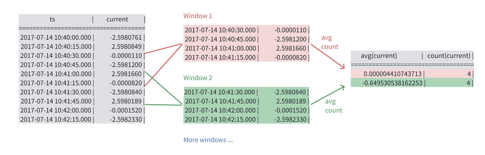

export const ToSql = ()=>(<a href="../../../taos-sql/distinguished">「SQL 手册/窗口查询」</a>);

在时序数据的分析计算中，经常需要使用窗口计算。以[智能电表示例数据](../../../get-started/package)为例：

- 求某个电表的每月用电量
- 对电表数据进行进行降采样，减少冗余
- 运用分析算法（比如 FFT）时需要把采集的数据严格按照时间等间隔的对齐

使用窗口查询时，数据被划分进不同的窗口（窗口可能重叠，这时一个数据属于多个窗口），每个窗口内的数据单独进行聚合运算，可以满足如上需求。

## 窗口类型

TDengine 支持如下四种窗口：

- 滑动时间窗口：按照固定时间长度和滑动步长，进行窗口划分
- 会话窗口：按照相邻数据点的时间间隔，进行窗口划分
- 状态窗口：按照指定列的值的变化情况，进行窗口划分
- 事件窗口：按照给定的起始条件和结束条件，进行窗口划分

本文仅介绍滑动时间窗口和状态事件窗口的使用，其他窗口类型请参考<ToSql/>。

## 窗口起止时间

每个窗口，都有其开始和结束时间，这些信息可使用如下伪列获取：

- `_wstart`：窗口起始时间
- `_wend`：窗口终止时间
- `_wduration`：窗口长度（即终止时间减起始时间）

## 滑动时间窗口

使用下列命令，计算电表 `d233` 的每小时用电量（单位：kJ）： 

```sql
SELECT _wstart, _wend, TWA(voltage*current*COS(phase))*_wduration as consumption
    FROM test.d233
    INTERVAL(1h);
```
`INTERVAL(1h)` 指定了长度为 1 小时的时间窗口，计算每个窗口的用电量。其中 `TWA` 用于计算加权平均值：`TWA(x)` 的值等于 `x` 在区间内的积分，除以区间长度。

滑动时间窗口，还可以用 `SLIDING` 指定滑动步长。下列语句，对电表 `d234` 的电流值进行了时间平滑处理：

```sql
SELECT _wstart, TWA(current), COUNT(current) AS point_number FROM test.d234 INTERVAL(1h) SLIDING(30m) LIMIT 10;
```

一个窗口向右平移一个滑动步长的距离，得到下一个窗口，由于本例中的滑动步长小于时间窗口长度，因此窗口之间存在重叠。每个窗口通过 `TWA` 函数计算电流的时间加权平均值，并用 `COUNT` 统计了窗口内点的个数。



观察第一行的 `_wstart` 和 `point_number`，可以看到，第一个窗口的起始时间并没有和第一个数据点对齐。这是因为，窗口适合**时间原点**对齐的。窗口的开始时间和时间原点之间的间隔，必须是 SLIDING 滑动步长的倍数。第一个窗口刚好能覆盖到数据，也就是说，将其前移一个滑动步长，就不再覆盖任何数据。时间原点的决定方式如下：

- 如果时间窗口长度的单位为年、月、日，即以所在时区的 1970-01-01 00:00:00 作为时间原点
- 如果时间窗口长度使用更小的单位，即以 UNIX 时间起点作为时间原点（1970-01-01 00:00:00 UTC+0）

## 事件窗口

使用事件窗口，需指定开启和结束条件，当数据满足开启条件，则该条数据及其后的数据都会被放入该窗口，直到某条数据满足结束条件时，关闭窗口。依此类推，生成所有的窗口。如果最后一个窗口未关闭，数据已经读完，则该窗口会被遗弃。

下列例子，使用事件窗口将电表 `d235` 电压值高于 10V 的时间段进行了抓取，得到起止时间、持续时长和时段内平均电压、电流：

```sql
SELECT _wstart, _wend, _wduration, TWA(voltage), TWA(current) FROM test.d235
    EVENT_WINDOW
        START WITH voltage >= 10
        END WITH voltage < 10;
```

其中 `START WITH` 和 `END WITH` 分别指定了窗口的开启条件和结束条件。

## HAVING
在窗口查询中，可以使用 HAVING，对每个窗口进行（带聚合函数的）过滤；下例仅查询分钟平均电流大于 0 的窗口：

```sql
SELECT _wstart, AVG(current) FROM test.d236 INTERVAL(1m) SLIDING(30s) HAVING AVG(current)>0;
```

## 更多内容

关于窗口查询的详尽语法细节，请参考<ToSql/>。