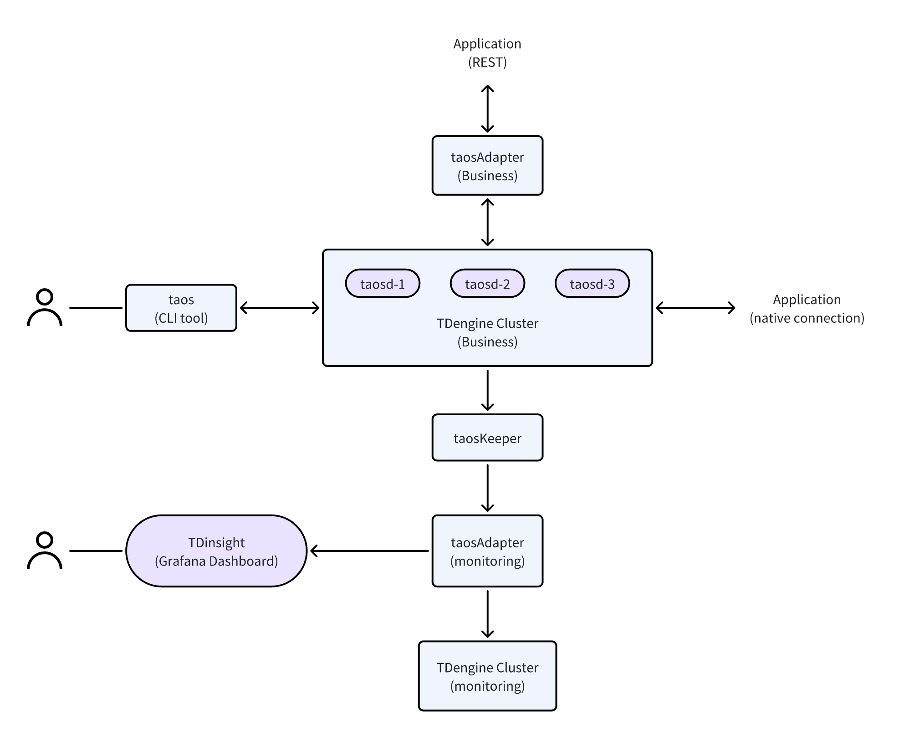

## 服务架构概览

下图展示了整个 TDengine 产品生态的部署架构，其所有核心组件都来自于 [TDengine server 安装包](../server-installation)。

    

对上图中各组件解释如下：

1. **TDengine cluster (business)** 是指存储业务数据的目标集群，简称为业务集群，它也是监控数据产生的源头，同时还是 taos explorer 可视化工具管理的对象

2. **taosAdapter (business)** 是为 业务集群提供 RESTful 和 Websocket 访问接口的服务，它既可以是单一实例，也可以是多个实例配合反向代理（如nginx）

3. **taosKeeper** 是将监控数据产生的源头产生的监控数据转入存储监控数据的 TDengine 集群的服务

4. **taosAdapter (monitoring)** 是为监控集群提供 RESTful 和 Websocket 访问接口的服务。如果监控集群与业务集群是相同集群，则与它们配套的 taosAdapter 可以是相同实例也可以是不同实例。但如果这两个是不同集群，则与它们配套的 taosAdapter 一定是不同实例。同样， taosAdapter 可以是单一实例也可以是配合反向代理的多实例

5. **TDinsight (Grafana)**：存储在监控集群中的监控数据可以通过 Grafana 来呈现关键的监控指标

6. **taos**：taos 是 TDengine 的命令行交互界面；用户通过 taos 执行 SQL 命令，实现集群的管理和数据操作