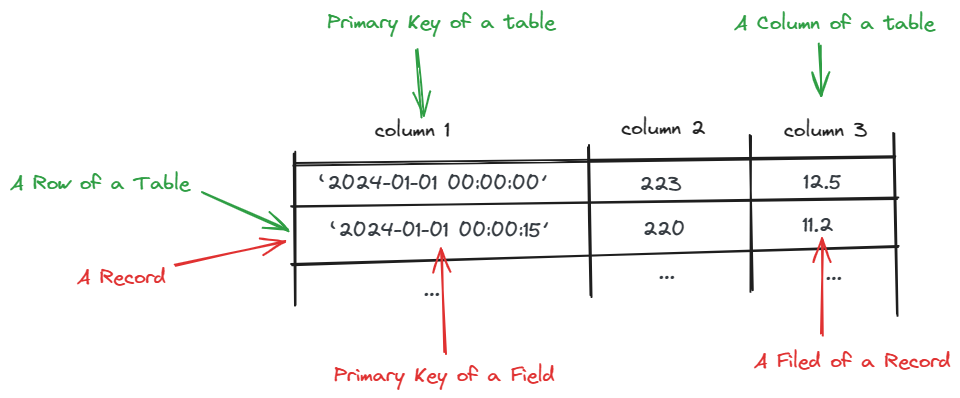
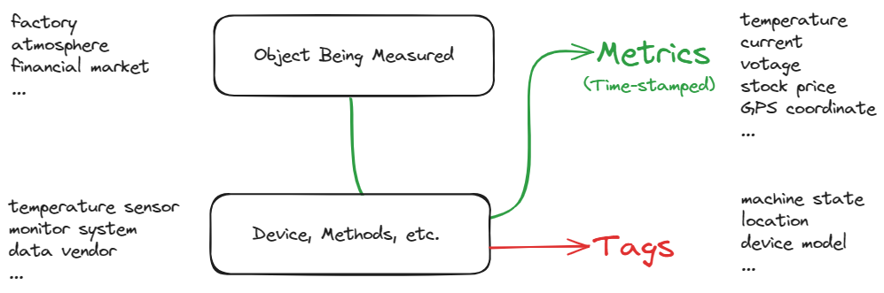
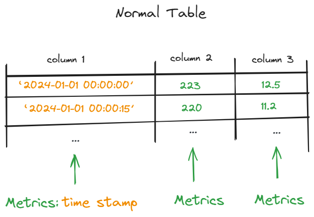
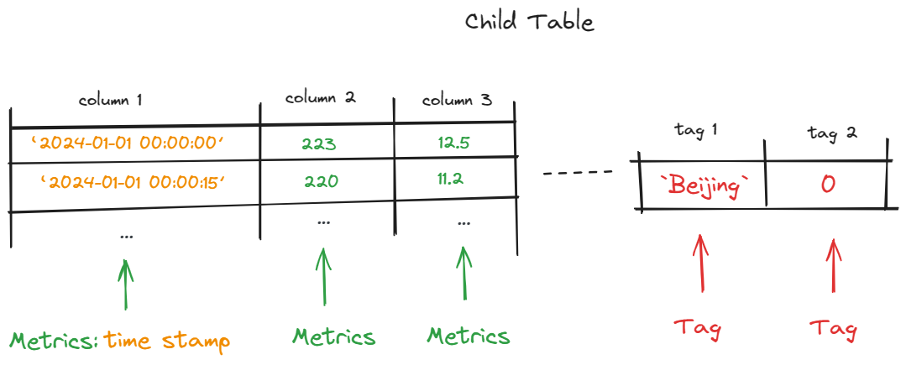
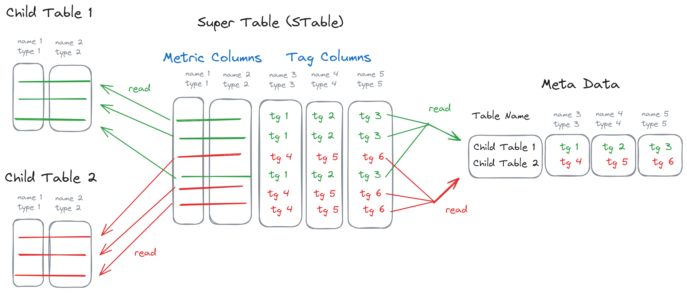
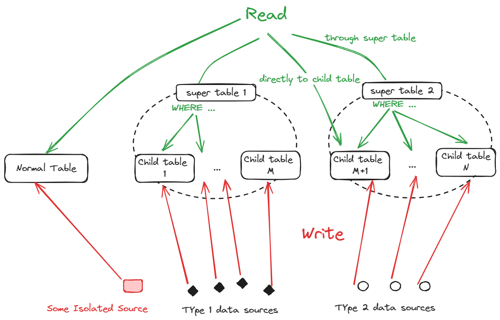
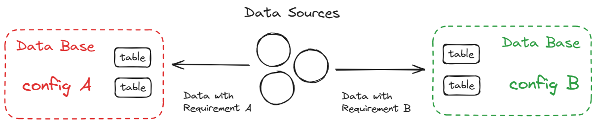

## 数据和表

在标准 SQL 的数据模型中，一条数据（Record）由若干个字段（Field）组成；数据存储于表（Table）中，表的每一行（Row）对应一条数据，每一列（Column）对应一个字段。每个表都必须有一列，作为主键（Primary Key）；主键是一条数据在表中的唯一标识，不同记录的主键不能重复。

TDengine 支持 SQL，为用户降低了学习成本。但与此同时，TDengine 的数据模型与 SQL 并不完全一致，必须充分理解 TDengine 的数据模型，才能正确地在 TDengine 中使用 SQL。

## 表的类型

TDengine 内部存在三种类型的表（Table）：

- 普通表（Normal Table）：通过普通表，可对数据进行查询、写入和删除
- 子表（Child Table）：与普通表基本相同，但每个子表含有一组标签，且从属于某个超级表
- 超级表（Super Table）：通过超级表，可以对下属的所有子表进行查询和管理；超级表不存储数据，**不能写入**

## 数据采集点

数据采集点是指按照预设时间周期或受事件触发采集物理量的硬件或软件。一个数据采集点可以采集一个或多个采集数据，但这些采集数据都是同一时刻采集的，具有相同的时间戳。

## 采集数据与标签

处理时序数据时，经常需要处理两类数据：

- 采集数据（Metric）：来自于被观测对象的时序数据，例如：电流的变化、金融资产价格波动等；这一类数据，需记录值随时间的变化，**是时间序列**。
- 标签（Tag）：来自于观测手段/设备的信息，例如：采集设备的铭牌信息、监测点位置、当前工作状态等；这一类数据**不是时间序列**，因为它们的值不发生改变，或者仅需记录当前值，无需记录值随时间的变化。

## 普通表

普通表的各列用于存储采集数据，其第一列用于储存时间戳主键。

## 时间戳主键

在 TDengine 中，主键的类型必须为时间戳（TIMESTAMP）。每张表的第一列必须为时间戳主键。

## 超级表-子表

普通表只处理采集数据，适用于孤立的采集点；当面对大量同类型采集点时，标签数据变得至关重要，需要使用超级表和子表。

与普通表一样，子表的各列用于存储采集数据。但同时，每个子表都带有一组标签（Tag）。

子表不能独立存在，必须从属于某个超级表。属于同一超级表下的所有子表具有相同的结构（schema），该结构由其从属的超级表来定义。

超级表的列分为两类：采集列（metric column）和标签列（tag column）。超级表并不储存信息，而是汇总了下属所有子表的采集数据、以及各个子表的标签，并以表的形式呈现出来。

如图所示：

- 采集数据和标签采取不同存储模式：采集数据存放于子表（Child Table）；每个子表的标签数据集中存放于元数据表（Meta Data）
- 超级表汇总了子表信息：
    - 超级表的采集列包含了所有子表的数据，其数据需要到子表中读取
    - 超级表的标签列包含了所有子表的标签，其数据需要到元数据表中读取
- 超级表是子表的模板：
    - 超级表的采集列定义了子表的列结构（即每一列是什么名称、类型）
    - 超级表的标签列定义了子表标签的结构（即每个标签是什么名称、类型）

通过超级表，可以查询下属子表的数据，但不能写入数据；在写入数据时，必须明确定位到被写入的子表。

### 一个数据采集点一张表

使用 TDengine 时，应该采取**一个数据采集点一张表**的建表策略，保障每个子表只有一个写入者。同时，通过超级表，实现同类型子表的统一管理和多表查询。

如图所示，超级表-子表的读写模式具有如下特点：

- 一个子表对应一个写入者；为此，可以采取无锁写入和追加写入，提高写入速度
- 超级表作为模板，便于批量创建、删除和修改子表
- 当查询超级表时，超级表根据标签过滤条件，找到所需的子表，读取数据

## 数据库

在 TDengine 中，所有表（普通表、超级表、子表）都属于且仅属于一个数据库（Database）。每个数据库的配置参数都可以被单独设置，以便用户通过多个数据库，实施多种存储策略，应对多样化的存储需求。

