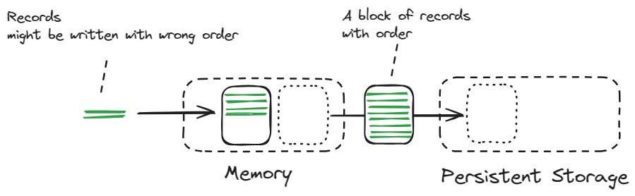

TDengine 充分利用各种缓存技术，实现了高效写入和查询。本节将对 TDengine 的缓存使用进行介绍。

本文涉及一部分内部架构的概念，如需深入了解请参考[「技术内幕」](../internals)。

## 写缓存

TDengine 将写入数据暂存于内存中，当内存数据量超过一定阈值时，自动将最早到达的一批数据整合（Compaction），并写入硬盘（FIFO 策略），因此，内存中可能保留着最近到达的部分数据。而物联网用户最关心的，正是最近产生的数据，TDengine 充分利用了这一特性，将最近到达的数据保存在缓存中，提升了数据读取的效率。



在创建数据库时，通过以下配置参数控制缓存的大小：

- `VGROUPS` 控制 vgroup 的数量，vgroup 中包含 1 至多个 vnode；数据库的数据运算、存储，将由这些 vgroup 分担
- `BUFFER` 控制每个 vnode 的缓存池大小

```sql
CREATE DATABASE test_db VGROUPS 8 BUFFER 16; -- 8 个 vgrouop，每个 vnode 有 16M 缓存;
```

理论上，缓存越大越好，但超过一定阈值后，不再有增益效果；一般情况下使用默认值即可。

## 读缓存

在物联网等时序数据场景下，最新写入的数据，往往是最经常被查询的数据。通过数据库参数 `CACHEMODEL` 配置，可以将最新写入的数据进行缓存，从而加快查询速度。`CACHEMODEL` 有以下几个选项：

- `none`：不缓存
- `last_row`：缓存最近的一行数据；显著提升函数 `LAST_ROW()` 的性能
- `last_value`：缓存每一列中，最近的一个非 NULL 值；提升函数 `LAST()` 的性能
- `both`：同时保存 `last_row` 和 `last_value`

```sql
CREATE DATABASE test_db CACHEMODEL last_row;
```

## 元数据缓存

元数据包括表名、表结构、集群拓扑结构等信息。每个 vnode 都会缓存最近获取到的元数据，从而加快查询和写入。元数据缓存由以下两个参数控制：

- `PAGES`：缓存页的数量
- `PAGESIZE`：每个缓存页的大小

总的缓存大小等于缓存页数量乘以缓存页大小。

```sql
CREATE DATABASE test_db pages 128 pagesize 16; -- pagesize= 16KB; total cache = 128*16KB = 2MB 
```

## 文件系统缓存

在数据被写入内存和硬盘之前，首先被写入 WAL 文件（Write Ahead Log）。

如前文所述，总有一部分写入数据，存储于内存中，还未来得及落盘。如果发生宕机，内存中未落盘的数据将会丢失，这时，可以从 WAL 中恢复这部分数据。

然而，由于操作系统的文件读写机制，写入 WAL 的数据也会被缓存起来。在发生宕机时，被缓存的 WAL 数据也会丢失。这一行为，可由数据库参数 `WAL_LEVEL` 调控，`WAL_LEVEL` 有两个可选值：

- `1`：写入 WAL 时，按照操作系统的规则，先将数据缓存，再落盘
- `2`：周期性执行系统函数 `fsync()`，强制 WAL 数据落盘（以性能下降为代价）

```sql
CREATE DATABASE test_db WAL_LEVEL 1;
```

## 客户端缓存

当客户端调用 taosc 进行原生连接时，taosc 会将访问过的元数据（数据库、表、集群拓扑结构）进行缓存。

当使用多个客户端同时访问 TDengine 集群时，某一客户端对元数据的修改，可能导致客户端之间的元数据缓存不一致。这时，需要在客户端执行下列语句，拉取最新的元数据：

```sql
RESET QUERY CACHE;
```